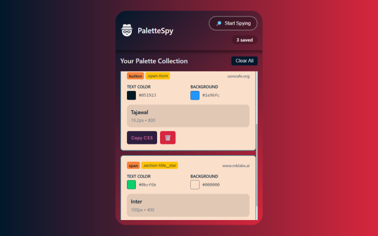
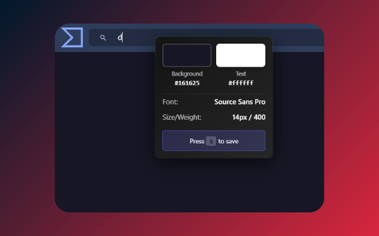

# PaletteSpy

A Chrome extension that lets you inspect and save color palettes and fonts from any website with a simple hover and keypress.



## 🎨 Features

- **Live Element Inspection**: Hover over any element to see its colors and fonts
- **Smart Filtering**: Only shows elements with interesting styles (no empty divs)
- **Instant Save**: Press 'S' to save the palette
- **Cursor Following**: Tooltip smoothly follows your mouse for precise inspection
- **Organized Collection**: View all saved palettes in the popup
- **One-Click Copy**: Copy CSS styles with a single click
- **Per-Tab State**: Spy mode state persists when you reopen the popup (only in the same URL or path) 
- **Auto Cleanup**: Mode automatically cleans up when tabs close



### Must have

- [Node.js](https://nodejs.org/) 
- [Bun](https://bun.sh/) 

### Setup

```bash
bun install

bun run dev

# Build for prod
bun run build

# Create zip 
bun zip

# that's it!
```

### 📝 License
MIT